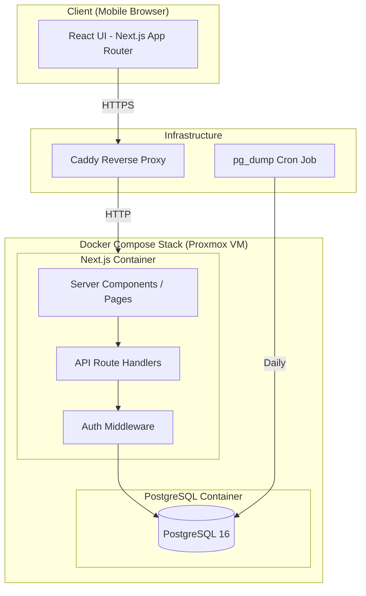
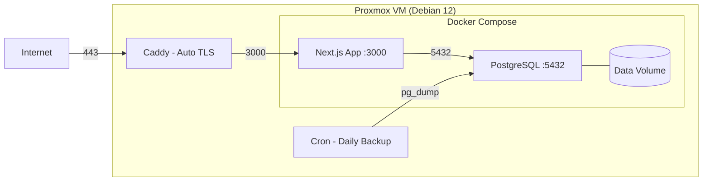
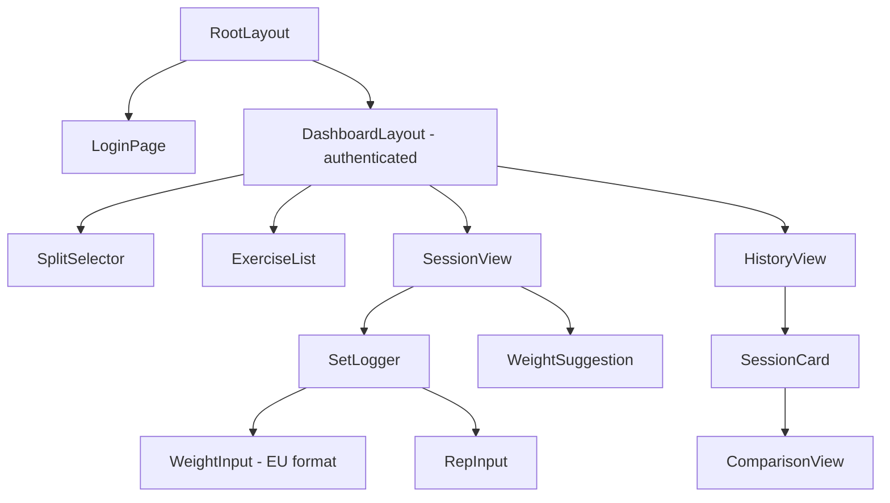
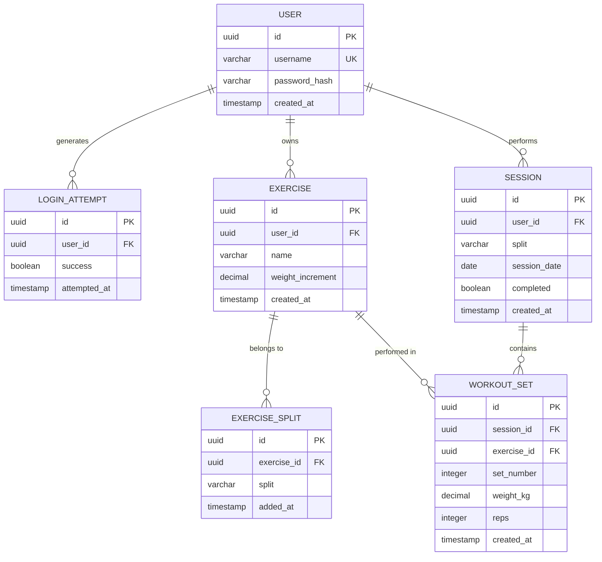

# Design Document: Gym Tracker

## Overview

Gym Tracker is a mobile-first web application for logging gym workouts with progressive overload tracking. The system serves a small number of EU-based users (2 concurrent) on a self-hosted Linux Proxmox VM. It provides workout split organization, exercise management, session logging with weight/reps/sets, historical comparison, and intelligent weight suggestions.

**Key Design Decisions:**
- **Full-stack TypeScript** — shared types between frontend and backend, single language for the entire stack
- **Next.js (App Router)** — server-side rendering for fast LCP, API routes for backend, single deployable unit
- **PostgreSQL** — ACID-compliant relational database for reliable persistent storage
- **Docker Compose** — containerized deployment on Proxmox VM with automatic restart
- **JWT with HTTP-only cookies** — stateless auth with 30-day session duration
- **EU-first localization** — kg, DD.MM.YYYY, comma decimals, 24h time baked into all components

## Architecture

The application follows a three-tier architecture deployed as a single Docker Compose stack:



### Request Flow

1. Mobile browser sends HTTPS request to Caddy reverse proxy
2. Caddy terminates TLS and forwards to Next.js container (port 3000)
3. Next.js middleware validates JWT from HTTP-only cookie
4. Server Components or API Route Handlers process the request
5. Database queries are scoped to the authenticated user's ID
6. Response rendered server-side (pages) or returned as JSON (API)

### Deployment Architecture



## Components and Interfaces

### Frontend Components



| Component | Responsibility |
|-----------|---------------|
| `LoginPage` | Username/password form, error display, lockout messaging |
| `SplitSelector` | Tab-based navigation between UPPER, LOWER, ARMS |
| `ExerciseList` | Display exercises for selected split, add/edit/remove actions |
| `SessionView` | Active session logging with set entry forms |
| `SetLogger` | Individual set entry (weight, reps) with validation |
| `WeightInput` | Numeric input accepting comma/dot decimal, displays EU format |
| `WeightSuggestion` | Displays calculated suggestion with override option |
| `HistoryView` | Paginated session history list |
| `SessionCard` | Single session summary with expandable detail |
| `ComparisonView` | Side-by-side current vs previous session data |

### API Route Handlers

| Endpoint | Method | Description |
|----------|--------|-------------|
| `/api/auth/login` | POST | Authenticate user, set JWT cookie |
| `/api/auth/logout` | POST | Clear JWT cookie |
| `/api/auth/me` | GET | Return current user info |
| `/api/exercises` | GET | List exercises (filtered by split query param) |
| `/api/exercises` | POST | Create exercise |
| `/api/exercises/[id]` | PUT | Update exercise name |
| `/api/exercises/[id]` | DELETE | Remove exercise from split |
| `/api/sessions` | GET | List sessions (paginated, filtered by split) |
| `/api/sessions` | POST | Create new session |
| `/api/sessions/[id]` | GET | Get session detail with all sets |
| `/api/sessions/[id]/complete` | POST | Mark session as complete |
| `/api/sets` | POST | Log a set within a session |
| `/api/sets/[id]` | PUT | Edit a set |
| `/api/sets/[id]` | DELETE | Delete a set |
| `/api/suggestions/[exerciseId]` | GET | Get weight suggestion for exercise |

### Backend Services

| Service | Responsibility |
|---------|---------------|
| `AuthService` | Password hashing (bcrypt), JWT creation/validation, lockout tracking |
| `ExerciseService` | CRUD operations, duplicate name checking, split association |
| `SessionService` | Session lifecycle, completion validation |
| `SetService` | Set CRUD within sessions, weight/rep validation |
| `SuggestionService` | Progressive overload calculation logic |
| `FormatService` | EU localization (weight formatting, date formatting) |

### Middleware

| Middleware | Responsibility |
|------------|---------------|
| `authMiddleware` | Validates JWT on all `/api/*` and protected page routes |
| `rateLimitMiddleware` | Tracks failed login attempts, enforces 5-attempt lockout |

## Data Models

### Entity Relationship Diagram



### Table Definitions

**users**
| Column | Type | Constraints |
|--------|------|-------------|
| id | UUID | PK, DEFAULT gen_random_uuid() |
| username | VARCHAR(50) | UNIQUE, NOT NULL |
| password_hash | VARCHAR(255) | NOT NULL |
| created_at | TIMESTAMPTZ | DEFAULT NOW() |

**login_attempts**
| Column | Type | Constraints |
|--------|------|-------------|
| id | UUID | PK, DEFAULT gen_random_uuid() |
| user_id | UUID | FK → users.id, NOT NULL |
| success | BOOLEAN | NOT NULL |
| attempted_at | TIMESTAMPTZ | DEFAULT NOW() |

**exercises**
| Column | Type | Constraints |
|--------|------|-------------|
| id | UUID | PK, DEFAULT gen_random_uuid() |
| user_id | UUID | FK → users.id, NOT NULL |
| name | VARCHAR(50) | NOT NULL |
| weight_increment | DECIMAL(3,1) | DEFAULT 1.0, CHECK (0.5–5.0, step 0.5) |
| created_at | TIMESTAMPTZ | DEFAULT NOW() |

**exercise_splits**
| Column | Type | Constraints |
|--------|------|-------------|
| id | UUID | PK, DEFAULT gen_random_uuid() |
| exercise_id | UUID | FK → exercises.id, NOT NULL |
| split | VARCHAR(10) | NOT NULL, CHECK IN ('UPPER','LOWER','ARMS') |
| added_at | TIMESTAMPTZ | DEFAULT NOW() |
| | | UNIQUE(exercise_id, split) |

**sessions**
| Column | Type | Constraints |
|--------|------|-------------|
| id | UUID | PK, DEFAULT gen_random_uuid() |
| user_id | UUID | FK → users.id, NOT NULL |
| split | VARCHAR(10) | NOT NULL, CHECK IN ('UPPER','LOWER','ARMS') |
| session_date | DATE | NOT NULL |
| completed | BOOLEAN | DEFAULT FALSE |
| created_at | TIMESTAMPTZ | DEFAULT NOW() |

**workout_sets**
| Column | Type | Constraints |
|--------|------|-------------|
| id | UUID | PK, DEFAULT gen_random_uuid() |
| session_id | UUID | FK → sessions.id, NOT NULL |
| exercise_id | UUID | FK → exercises.id, NOT NULL |
| set_number | INTEGER | NOT NULL, CHECK (1–50) |
| weight_kg | DECIMAL(5,1) | NOT NULL, CHECK (0.0–500.0) |
| reps | INTEGER | NOT NULL, CHECK (1–999) |
| created_at | TIMESTAMPTZ | DEFAULT NOW() |

### Key Indexes

- `idx_exercises_user_id` on exercises(user_id)
- `idx_exercise_splits_exercise_id` on exercise_splits(exercise_id)
- `idx_sessions_user_id_date` on sessions(user_id, session_date DESC)
- `idx_workout_sets_session_id` on workout_sets(session_id)
- `idx_workout_sets_exercise_id` on workout_sets(exercise_id)
- `idx_login_attempts_user_id_time` on login_attempts(user_id, attempted_at DESC)

### TypeScript Types

```typescript
type WorkoutSplit = 'UPPER' | 'LOWER' | 'ARMS';

interface User {
  id: string;
  username: string;
  createdAt: Date;
}

interface Exercise {
  id: string;
  userId: string;
  name: string;
  weightIncrement: number; // 0.5–5.0 in 0.5 steps
  splits: WorkoutSplit[];
  createdAt: Date;
}

interface Session {
  id: string;
  userId: string;
  split: WorkoutSplit;
  sessionDate: Date;
  completed: boolean;
  createdAt: Date;
}

interface WorkoutSet {
  id: string;
  sessionId: string;
  exerciseId: string;
  setNumber: number; // 1–50
  weightKg: number; // 0.0–500.0 in 0.5 steps
  reps: number; // 1–999
  createdAt: Date;
}

interface WeightSuggestion {
  exerciseId: string;
  suggestedWeightKg: number | null;
  reasoning: 'increase' | 'maintain' | 'no_history';
  previousWeightKg: number | null;
  incrementKg: number;
}
```

## Correctness Properties

*A property is a characteristic or behavior that should hold true across all valid executions of a system — essentially, a formal statement about what the system should do. Properties serve as the bridge between human-readable specifications and machine-verifiable correctness guarantees.*

### Property 1: Data isolation between users

*For any* two authenticated users A and B, and any resource (Exercise, Session, WorkoutSet) created by user A, querying that resource as user B SHALL return a "not found" response identical to querying a non-existent resource ID.

**Validates: Requirements 1.4, 9.1, 9.2, 9.3, 9.4, 9.5**

### Property 2: Unauthenticated access rejection

*For any* API endpoint that requires authentication and any request without a valid JWT token, the system SHALL reject the request and return an unauthorized response.

**Validates: Requirements 1.5**

### Property 3: Authentication error uniformity

*For any* login attempt with invalid credentials (wrong username, wrong password, or both), the system SHALL return the same error message regardless of which field was incorrect.

**Validates: Requirements 1.2**

### Property 4: Exercise ordering within split

*For any* set of exercises belonging to a workout split for a user, querying that split SHALL return exercises ordered by their `added_at` timestamp descending (most recently added first).

**Validates: Requirements 2.2**

### Property 5: Multi-split exercise membership

*For any* exercise and any subset of the three workout splits, adding the exercise to each split in the subset SHALL succeed, and querying each split SHALL include that exercise.

**Validates: Requirements 2.3**

### Property 6: Duplicate split association rejection

*For any* exercise already associated with a specific workout split, attempting to add the same exercise to the same split again SHALL be rejected.

**Validates: Requirements 2.4**

### Property 7: Exercise name validation and trimming

*For any* input string, creating an exercise SHALL trim leading/trailing whitespace and accept the name only if the trimmed result is between 1 and 50 characters (inclusive). Strings that are empty after trimming or exceed 50 characters SHALL be rejected.

**Validates: Requirements 3.1, 3.6**

### Property 8: Case-insensitive exercise name uniqueness

*For any* two exercise name strings that are equal when compared case-insensitively, attempting to create or rename an exercise to the second name within the same workout split SHALL be rejected when the first already exists.

**Validates: Requirements 3.4, 3.5**

### Property 9: History preservation on exercise removal or rename

*For any* exercise with associated session logs, removing the exercise from a split or renaming it SHALL preserve all historical session logs referencing that exercise.

**Validates: Requirements 2.5, 3.2, 3.3**

### Property 10: Workout set value validation

*For any* numeric weight value and rep count, the system SHALL accept the set if and only if weight is in [0.0, 500.0] in 0.5 kg increments AND reps is an integer in [1, 999]. Values outside these ranges SHALL be rejected.

**Validates: Requirements 4.2, 4.7**

### Property 11: Session completion round-trip

*For any* completed session containing N sets, querying that session from the history store SHALL return exactly those N sets with identical weight, reps, and set number values.

**Validates: Requirements 4.4, 5.2**

### Property 12: Session history ordering and pagination

*For any* collection of sessions for a user, querying session history SHALL return sessions ordered by session_date descending, with each page containing at most 50 sessions.

**Validates: Requirements 5.1**

### Property 13: Exercise comparison lookup

*For any* exercise viewed within a session, the comparison SHALL display the most recent prior session log for that same exercise by the same user. If no prior session exists, it SHALL indicate no prior data.

**Validates: Requirements 5.3, 5.4**

### Property 14: Progressive overload — increase suggestion

*For any* exercise where the most recent session log shows the user completed all sets with the same or greater reps per set compared to the session before it, the weight suggestion SHALL equal the most recent weight plus the configured increment for that exercise.

**Validates: Requirements 6.3**

### Property 15: Progressive overload — maintain suggestion

*For any* exercise where the most recent session log shows fewer sets or fewer reps in any set compared to the session before it, the weight suggestion SHALL equal the most recent session's weight (no increase).

**Validates: Requirements 6.4**

### Property 16: Weight formatting (EU locale)

*For any* numeric weight value, the formatted display string SHALL use a comma as the decimal separator, show exactly one decimal place (0.5 precision), and include the "kg" suffix (e.g., 72.5 → "72,5 kg").

**Validates: Requirements 4.6, 8.1**

### Property 17: Date formatting (EU locale)

*For any* valid date, the formatted display string SHALL match the pattern DD.MM.YYYY where DD is zero-padded day, MM is zero-padded month, and YYYY is four-digit year.

**Validates: Requirements 5.6, 8.2**

### Property 18: Weight input parsing equivalence

*For any* valid weight value, entering it with a comma decimal separator and entering it with a dot decimal separator SHALL produce the same parsed numeric value.

**Validates: Requirements 8.3**

### Property 19: Time formatting (24-hour)

*For any* valid time value, the formatted display string SHALL match the pattern HH:MM where HH is 00–23 and MM is 00–59.

**Validates: Requirements 8.4**

### Property 20: Malformed weight input rejection

*For any* string containing more than one decimal separator character or any non-numeric character other than a single comma or dot, the weight input parser SHALL reject it.

**Validates: Requirements 8.5**

## Error Handling

### Client-Side Error Handling

| Scenario | Behavior |
|----------|----------|
| Network failure during write | Retain data in client state, show toast notification, auto-retry up to 3 times (2s intervals) |
| All retries exhausted | Show persistent error banner with manual retry button, preserve unsaved data |
| Authentication expired | Redirect to login, discard unsaved client state |
| Validation error (4xx) | Display inline error message next to the relevant field |
| Server error (5xx) | Show generic error toast, log to console, retain form state |
| Offline detection | Show offline indicator, queue writes for retry when connection restores |

### Server-Side Error Handling

| Scenario | Response | Behavior |
|----------|----------|----------|
| Invalid credentials | 401 Unauthorized | Generic "Invalid credentials" message |
| Account locked | 429 Too Many Requests | "Account locked for 15 minutes" with Retry-After header |
| Missing/invalid JWT | 401 Unauthorized | Redirect to login |
| Resource not found / wrong user | 404 Not Found | Same response for both (data isolation) |
| Validation failure | 400 Bad Request | Structured error with field-level messages |
| Database write failure | 500 Internal Server Error | Log error, return generic message |
| Duplicate exercise name | 409 Conflict | "Exercise name already exists in this split" |

### Database Error Recovery

```typescript
async function withRetry<T>(
  operation: () => Promise<T>,
  maxRetries: number = 3,
  delayMs: number = 2000
): Promise<T> {
  for (let attempt = 1; attempt <= maxRetries; attempt++) {
    try {
      return await operation();
    } catch (error) {
      if (attempt === maxRetries) throw error;
      await new Promise(resolve => setTimeout(resolve, delayMs));
    }
  }
  throw new Error('Unreachable');
}
```

## Testing Strategy

### Testing Stack

| Tool | Purpose |
|------|---------|
| **Vitest** | Unit tests and property-based tests |
| **fast-check** | Property-based testing library |
| **Playwright** | E2E tests on mobile viewports |
| **Lighthouse CI** | Performance testing (LCP) |
| **Docker Compose** | Integration test environment |

### Property-Based Tests (fast-check)

Each correctness property from the design document is implemented as a property-based test using `fast-check`. Configuration:
- Minimum **100 iterations** per property test
- Each test tagged with: `Feature: gym-tracker, Property {number}: {title}`
- Generators produce random valid and invalid inputs covering edge cases

**Key property test areas:**
- `FormatService`: Weight formatting, date formatting, time formatting, input parsing (Properties 16–20)
- `SuggestionService`: Progressive overload algorithm (Properties 14–15)
- `ExerciseService`: Name validation, case-insensitive uniqueness, multi-split membership (Properties 5–9)
- `SetService`: Value range validation (Property 10)
- `AuthMiddleware`: Data isolation, unauthenticated rejection (Properties 1–3)
- `SessionService`: Ordering, pagination, completion round-trip (Properties 11–12)

### Unit Tests (Vitest)

Focus on specific examples and edge cases not covered by property tests:
- Login lockout after exactly 5 failed attempts (Req 1.3)
- Session with 0 sets cannot be completed (Req 4.8)
- Empty split displays empty state (Req 2.6)
- No prior history returns null suggestion (Req 6.6)
- Session expiry after 30 days (Req 1.6)

### Integration Tests

- Database persistence across container restarts (Req 10.1)
- Write retry behavior with simulated DB failures (Req 10.3)
- Health check endpoint responds within 60s of deployment (Req 11.1)
- HTTPS termination via Caddy (Req 11.2)
- RAM usage under 512 MB with 2 concurrent users (Req 11.4)

### E2E Tests (Playwright)

- Full login → create exercise → log session → view history flow
- Mobile viewport (375px iPhone, 412px Pixel) without horizontal scroll
- Touch target sizes ≥ 44x44px
- Orientation change preserves form data
- Cross-browser: Safari iOS, Chrome Android (latest 2 versions)

### Test Organization

```
tests/
├── unit/
│   ├── format.test.ts          # EU formatting functions
│   ├── suggestion.test.ts      # Progressive overload logic
│   ├── validation.test.ts      # Input validation
│   └── auth.test.ts            # Auth logic
├── property/
│   ├── format.property.ts      # Properties 16-20
│   ├── suggestion.property.ts  # Properties 14-15
│   ├── exercise.property.ts    # Properties 4-9
│   ├── session.property.ts     # Properties 10-12
│   ├── isolation.property.ts   # Properties 1-3
│   └── history.property.ts     # Property 13
├── integration/
│   ├── database.test.ts        # Persistence, retries
│   └── deployment.test.ts      # Health, HTTPS, resources
└── e2e/
    ├── workout-flow.spec.ts    # Full user journey
    └── mobile.spec.ts          # Viewport, touch, orientation
```

